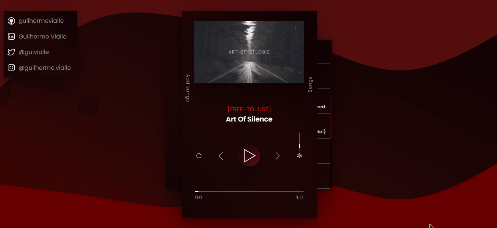

# Gruttles

## Minimalist Music App

> #### by guilhermevialle

-   ### Features

-   Responsive
-   Cool design
-   Small
-   100% Functional
-   Minimalist
-   Add musics
-   Select Musics
-   And much more!

### Preview

-   #### Player Interface

    

-   #### Usage

    

-   #### Guide to selecting and adding songs

    

-   #### You can add your own music, with your own images, names...

    

-   #### You can also choose which song you want to play in a list format
    

### About copy

-   All Copyrights Reserved.

### License

-   GNU General Public License

---

#### Social Media

-   https://twitter.com/guivialle
-   https://www.instagram.com/guilherme.vialle/
